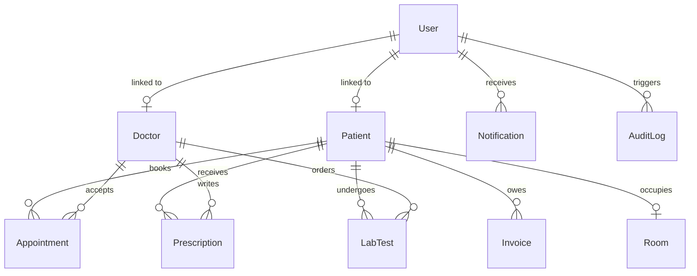

# Database Design Documentation — HMS Pro

This document describes the schema structure, data types, indexes, and entity relationships for the 12 MongoDB collections in the **AI-Powered Hospital Management System (HMS Pro)**.

---

## 🗄️ Database Schema Structures

### 1. Users Collection (`users`)
Stores credentials, core profile, active session state, and RBAC details for all platform users.

| Field | Type | Description |
| :--- | :--- | :--- |
| `_id` | ObjectId | Auto-generated unique identifier |
| `name` | String | User's full name (required) |
| `email` | String | Unique login email (required, indexed) |
| `password` | String | Bcyrpt-hashed password hash |
| `role` | String | Role enum: `super_admin`, `hospital_admin`, `doctor`, `nurse`, `receptionist`, `lab_technician`, `pharmacist`, `billing_executive`, `patient` |
| `department` | String | Department string (e.g., Cardiology, Pharmacy) |
| `phone` | String | Contact phone number |
| `avatar` | String | Initials/avatar URL reference |
| `isActive` | Boolean | True if user session/role is active |
| `refreshToken` | String | JWT Refresh token token |
| `lastLogin` | Date | Timestamp of last login |
| `createdAt` | Date | Timestamp of account creation |
| `updatedAt` | Date | Timestamp of last update |

### 2. Patients Collection (`patients`)
Stores clinical demographics, emergency contact details, health insurance details, and historical patient histories.

| Field | Type | Description |
| :--- | :--- | :--- |
| `_id` | ObjectId | Auto-generated unique identifier |
| `userId` | ObjectId | Reference to associated `User` record |
| `patientId` | String | Formatted unique clinical ID (e.g., `PAT-001`) |
| `name` | String | Full name |
| `dob` | Date | Date of birth |
| `gender` | String | Gender (Male, Female, Other) |
| `bloodGroup` | String | Blood type (A+, B+, O-, etc.) |
| `phone` | String | Phone |
| `email` | String | Email |
| `address` | Object | Sub-document: `{ street, city, state, pincode }` |
| `emergencyContact` | Object | Sub-document: `{ name, relation, phone }` |
| `insurance` | Object | Sub-document: `{ provider, policyNumber, validUntil }` |
| `medicalHistory` | Object | Sub-document: `{ allergies: [String], previousDiseases: [String], surgeries: [{ description, date }], currentMedications: [{ name, dosage }] }` |
| `isAdmitted` | Boolean | Inpatient status flag |
| `roomId` | ObjectId | Reference to `Room` (null if not admitted) |
| `createdAt` | Date | Timestamp |

### 3. Doctors Collection (`doctors`)
Holds professional medical clinical properties, consultation fee rates, availability rosters, and ratings.

| Field | Type | Description |
| :--- | :--- | :--- |
| `_id` | ObjectId | Auto-generated unique identifier |
| `userId` | ObjectId | Reference to associated `User` record |
| `doctorId` | String | Formatted unique clinical ID (e.g., `DOC-001`) |
| `name` | String | Full name |
| `specialization` | String | Specialization field (e.g., Cardiologist) |
| `department` | String | Department (e.g., Cardiology) |
| `qualifications` | Array[String]| Academic degrees (MBBS, MD, etc.) |
| `experience` | Number | Years of medical practice |
| `consultationFee` | Number | Fee per regular consultation in ₹ |
| `rating` | Number | Aggregated review rating score (0.0 to 5.0) |
| `schedule` | Array[Object] | Weekly availability: `[{ day, startTime, endTime, isAvailable }]` |
| `availableSlots` | Array[Object] | Date-specific slot availability: `[{ date, slots: [{ time, isBooked }] }]` |
| `phone` | String | Contact phone |
| `isAvailable` | Boolean | Direct presence flag |

### 4. Appointments Collection (`appointments`)
Tracks scheduling workflow stages between patients and doctors.

| Field | Type | Description |
| :--- | :--- | :--- |
| `_id` | ObjectId | Auto-generated unique identifier |
| `appointmentId` | String | Formatted unique schedule ID (e.g., `APT-001`) |
| `patientId` | ObjectId | Reference to associated `Patient` record |
| `doctorId` | ObjectId | Reference to associated `Doctor` record |
| `department` | String | Department |
| `date` | Date | Date of appointment |
| `timeSlot` | String | Slot name (e.g., `10:30 AM`) |
| `status` | String | Status enum: `Requested`, `Confirmed`, `In Consultation`, `Completed`, `Cancelled` |
| `type` | String | Type: `Regular`, `Emergency`, `Follow-up` |
| `symptoms` | String | Text describing symptoms |
| `notes` | String | General clinical comments |
| `diagnosis` | String | Diagnostic conclusion log (Completed stage) |
| `createdBy` | ObjectId | User ID of scheduler |
| `cancelledBy` | ObjectId | User ID of cancellation action |
| `cancelReason` | String | Reason for cancellation |

### 5. Prescriptions Collection (`prescriptions`)
Details treatment medication charts generated by doctors during consultation.

| Field | Type | Description |
| :--- | :--- | :--- |
| `_id` | ObjectId | Auto-generated unique identifier |
| `prescriptionId`| String | Unique ID (e.g., `PRE-001`) |
| `patientId` | ObjectId | Reference to associated `Patient` |
| `doctorId` | ObjectId | Reference to associated `Doctor` |
| `appointmentId`| ObjectId | Reference to associated `Appointment` |
| `diagnosis` | String | Summarized diagnosis |
| `symptoms` | String | Summarized symptoms |
| `medicines` | Array[Object] | Dosage list: `[{ name, dosage, frequency, duration, instructions }]` |
| `labTests` | Array[String] | Recommended lab tests |
| `treatmentPlan` | String | Detailed non-pharmaceutical treatment plan |
| `followUpDate` | Date | Suggested next visit date |
| `notes` | String | Additional clinical notes |
| `status` | String | Status: `Active`, `Dispensed`, `Expired` |
| `dispensedBy` | ObjectId | Reference to associated pharmacist user |
| `dispensedAt` | Date | Fulfillment timestamp |

### 6. Medical Records Collection (`medicalrecords`)
Holds binary/text based Electronic Medical Records (EMRs) uploaded by doctors or techs.

| Field | Type | Description |
| :--- | :--- | :--- |
| `_id` | ObjectId | Auto-generated unique identifier |
| `patientId` | ObjectId | Reference to associated `Patient` |
| `title` | String | File/record title |
| `type` | String | Enum: `Prescription`, `Lab Report`, `X-Ray`, `MRI Report`, `CT Scan`, `Discharge Summary`, `Other` |
| `category` | String | Category indicator |
| `fileUrl` | String | Link to file storage bucket (mock URL in demo) |
| `fileData` | String | Text-based EMR description or report details |
| `description` | String | Text description of the record |
| `uploadedBy` | ObjectId | User ID of uploader |
| `doctorId` | ObjectId | Reference to doctor (if uploaded during consultation) |
| `appointmentId` | ObjectId | Reference to associated `Appointment` (optional) |
| `tags` | Array[String]| Search keywords (e.g. cardiac, spine) |
| `isConfidential`| Boolean | True if accessible only by doctor/patient |

### 7. Lab Tests Collection (`labtests`)
Manages lab workflows and diagnostic test outcomes.

| Field | Type | Description |
| :--- | :--- | :--- |
| `_id` | ObjectId | Auto-generated unique identifier |
| `testId` | String | Unique test ID (e.g. `LAB-001`) |
| `patientId` | ObjectId | Reference to associated `Patient` |
| `doctorId` | ObjectId | Reference to ordering `Doctor` |
| `appointmentId`| ObjectId | Reference to associated `Appointment` (optional) |
| `testType` | String | Test category (e.g., Blood Test) |
| `testName` | String | Test name (e.g., Complete Blood Count) |
| `priority` | String | Priority: `Normal`, `Urgent`, `Emergency` |
| `status` | String | Enum: `Ordered`, `Sample Collected`, `Testing`, `Report Generated`, `Reviewed` |
| `result` | String | Text summary of diagnostic results |
| `cost` | Number | Billing cost for the test |
| `processedBy` | ObjectId | Reference to associated lab tech user |
| `sampleCollectedAt` | Date | Sample registration timestamp |
| `testStartedAt` | Date | Testing phase start timestamp |
| `completedAt` | Date | Completion timestamp |
| `reviewedAt` | Date | Review completion timestamp |
| `reportUrl` | String | URL link to the generated report file |
| `reportData` | String | Base64 encoded report data |
| `notes` | String | Additional notes about the test |

### 8. Medicines Collection (`medicines`)
Stores medicine inventory records for the hospital pharmacy.

| Field | Type | Description |
| :--- | :--- | :--- |
| `_id` | ObjectId | Auto-generated unique identifier |
| `name` | String | Commercial medicine name |
| `genericName` | String | Scientific compound name |
| `category` | String | Formulation: `Tablet`, `Capsule`, `Syrup`, `Injection`, etc. |
| `manufacturer` | String | Manufacturing brand |
| `supplier` | String | Supply channel name |
| `stock` | Number | Quantity remaining in storage |
| `minStock` | Number | Low threshold value for alert trigger |
| `price` | Number | Rate per unit in ₹ |
| `expiryDate` | Date | Expiration date |
| `batchNumber` | String | Batch registration code |
| `isAvailable` | Boolean | True if stock > 0 |
| `unit` | String | Unit of measurement (default: 'units') |
| `location` | String | Storage shelf/rack location in pharmacy |
| `description` | String | Medicine description or usage notes |

**Computed Virtuals:**
- `isLowStock` → Returns `true` when `stock <= minStock`
- `isExpired` → Returns `true` when current date exceeds `expiryDate`

### 9. Invoices Collection (`invoices`)
Governs billing records and transaction status.

| Field | Type | Description |
| :--- | :--- | :--- |
| `_id` | ObjectId | Auto-generated unique identifier |
| `invoiceId` | String | Unique ID (e.g. `INV-001`) |
| `patientId` | ObjectId | Reference to associated `Patient` |
| `appointmentId`| ObjectId | Reference to associated `Appointment` (optional) |
| `items` | Array[Object] | Invoice items: `[{ description, type, quantity, unitPrice, total }]` |
| `subtotal` | Number | Sum of item totals |
| `tax` | Number | GST/tax amount (e.g. 18% GST) |
| `discount` | Number | Discount applied |
| `totalAmount` | Number | Grand total due |
| `status` | String | Status: `Pending`, `Paid`, `Partial`, `Cancelled` |
| `paymentMethod`| String | Method: `UPI`, `Card`, `Cash`, `Insurance`, `Online` |
| `paidAmount` | Number | Accumulated amount collected |
| `paidAt` | Date | Final payment timestamp |
| `insurance` | Object | Sub-document: `{ provider, claimId, claimStatus, coveredAmount }` |
| `createdBy` | ObjectId | Reference to billing executive |
| `notes` | String | Additional billing notes |

### 10. Rooms Collection (`rooms`)
Represents inpatient beds and ward configurations.

| Field | Type | Description |
| :--- | :--- | :--- |
| `_id` | ObjectId | Auto-generated unique identifier |
| `roomNumber` | String | Unique room number identifier |
| `ward` | String | Enum: `General`, `ICU`, `Emergency`, `Maternity`, `Pediatric`, `Surgical`, `Orthopedic`, `Private` |
| `type` | String | Bed category: `Single`, `Double`, `Suite`, `ICU Bed`, `Emergency Bed` |
| `floor` | Number | Building floor number |
| `dailyRate` | Number | Daily bed rent rate in ₹ |
| `isOccupied` | Boolean | Occupancy status flag |
| `patientId` | ObjectId | Reference to admitted `Patient` |
| `admittedAt` | Date | Inpatient admission timestamp |
| `assignedDoctor`| ObjectId | Reference to primary `Doctor` |
| `assignedNurse` | ObjectId | Reference to assigned `User` (nurse) |
| `expectedDischargeAt` | Date | Expected patient discharge timestamp |
| `notes` | String | Clinical or ward notes |
| `features` | Array[String]| Amenities (AC, Ventilator support, TV, etc.) |

### 11. Notifications Collection (`notifications`)
Stores system, clinical, inventory, or billing feeds for specific users.

| Field | Type | Description |
| :--- | :--- | :--- |
| `_id` | ObjectId | Auto-generated identifier |
| `userId` | ObjectId | Reference to target user |
| `title` | String | Notification headline |
| `message` | String | Detail string |
| `type` | String | Category: `appointment`, `prescription`, `lab_report`, `emergency`, `billing`, `inventory`, `system`, `general` |
| `isRead` | Boolean | True if read by user |
| `priority` | String | Level: `low`, `medium`, `high`, `critical` |
| `link` | String | Navigation route link (e.g., `/appointments`) |
| `createdAt` | Date | Timestamp |

### 12. Audit Logs Collection (`auditlogs`)
Tracks administrative changes for regulatory safety.

| Field | Type | Description |
| :--- | :--- | :--- |
| `_id` | ObjectId | Auto-generated identifier |
| `userId` | ObjectId | Reference to acting user |
| `userEmail` | String | User email |
| `userRole` | String | User role |
| `action` | String | Action enum: `CREATE`, `READ`, `UPDATE`, `DELETE`, `LOGIN`, `LOGOUT` |
| `resource` | String | Entity name (e.g., `Patient`, `Invoice`, `Auth`) |
| `resourceId` | String | Affected entity database string identifier |
| `details` | String | Detailed description of the action |
| `ip` | String | Client IP address of the request |
| `userAgent` | String | Browser/client user-agent string |
| `status` | String | Outcome status (success/failure) |
| `createdAt` | Date | Log timestamp |

---

## 📊 Entity-Relationship Diagram (ERD)

---

## ⚡ Recommended Database Indexes

For performance scaling, the database schema implements the following mongoose-level indexes:

1.  **Users email lookup**:
    `UserSchema.index({ email: 1 }, { unique: true });`
2.  **Audit Logs by timestamp**:
    `AuditLogSchema.index({ createdAt: -1 });`
3.  **Appointments search query composite**:
    `AppointmentSchema.index({ patientId: 1, date: -1 });`
    `AppointmentSchema.index({ doctorId: 1, date: -1 });`
4.  **Medicine search index**:
    `MedicineSchema.index({ name: 1, genericName: 1 });`
5.  **Notifications target recipient unread composite**:
    `NotificationSchema.index({ userId: 1, isRead: 1 });`
