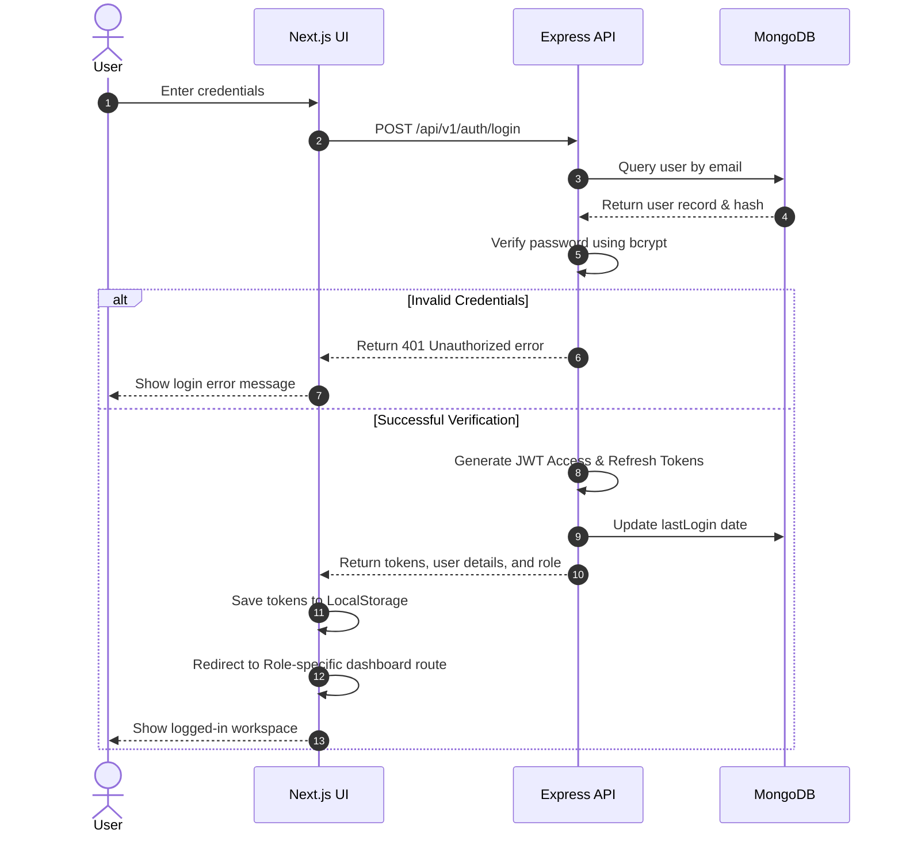

# System Architecture Documentation — HMS Pro

This document outlines the system architecture, authentication sequence, role-based access control (RBAC), security measures, and scalability features of **HMS Pro**.

---

## 🏛️ System Architecture Overview

HMS Pro is designed as a decoupled client-server web application following a tiered architecture. It separates the User Interface (UI), Application Programming Interface (API), and Database levels.

```mermaid
graph TD
    subgraph Client Layer [Client Layer - Next.js 14]
        UA[Patient UI]
        UD[Doctor UI]
        UN[Nurse UI]
        UR[Receptionist UI]
        UA[Admin / Super Admin UI]
    end

    subgraph API Gateway Layer
        AGW[Express.js App - Port 5001]
        HLM[Helmet Security Filters]
        COR[CORS Policy Engine]
        RLM[Rate Limiting Manager]
    end

    subgraph Core Application Services
        ATH[Auth Service & JWT Middleware]
        RBA[RBAC Middleware]
        CTR[Controllers Layer]
    end

    subgraph External & Database Services
        MDB[(MongoDB Database)]
        GEM[Google Gemini AI SDK]
        FIL[File Storage - /uploads]
    end

    Client Layer -->|HTTPS Requests| AGW
    AGW --> HLM
    HLM --> COR
    COR --> RLM
    RLM --> ATH
    ATH --> RBA
    RBA --> CTR
    CTR --> MDB
    CTR --> GEM
    CTR --> FIL
```

---

## 🔑 Authentication Sequence Flow

User sessions are secured using stateless JSON Web Tokens (JWT). The login process generates a short-lived Access Token and a long-lived Refresh Token stored in local storage.



---

## 🛡️ Role-Based Access Control (RBAC) Matrix

The system enforces strict route protection using custom Express middleware. The following matrix outlines the permissions of each role:

| Resource Path | Super Admin | Hospital Admin | Doctor | Nurse | Receptionist | Lab Tech | Pharmacist | Billing | Patient |
| :--- | :---: | :---: | :---: | :---: | :---: | :---: | :---: | :---: | :---: |
| `/api/v1/audit-logs` | **Full** | **Full** | None | None | None | None | None | None | None |
| `/api/v1/users` | **Full** | **Full** | None | None | None | None | None | None | None |
| `/api/v1/rooms` | **Full** | **Full** | Read | Read | Read | None | None | None | Read |
| `/api/v1/patients` | **Full** | **Full** | **Full** | **Full** | **Full** | Read | Read | Read | **Own** |
| `/api/v1/appointments`| **Full** | **Full** | **Full** | Read | **Full** | None | None | None | **Own** |
| `/api/v1/prescriptions`| **Full** | **Full** | **Full** | Read | None | None | **Full** | None | **Own** |
| `/api/v1/lab-tests` | **Full** | **Full** | **Full** | Read | None | **Full** | None | None | **Own** |
| `/api/v1/medicines` | **Full** | **Full** | Read | None | None | None | **Full** | None | None |
| `/api/v1/invoices` | **Full** | **Full** | None | None | None | None | None | **Full** | **Own** |
| `/api/v1/emergency` | **Full** | **Full** | **Full** | **Full** | **Full** | None | None | None | None |
| `/api/v1/doctors` | Read | Read | Read | Read | Read | Read | Read | Read | Read |
| `/api/v1/medical-records` | **Full** | **Full** | **Full** | **Full** | **Full** | **Full** | None | None | **Own** |
| `/api/v1/dashboard` | **Own** | **Own** | **Own** | **Own** | **Own** | **Own** | **Own** | **Own** | **Own** |
| `/api/v1/notifications` | **Own** | **Own** | **Own** | **Own** | **Own** | **Own** | **Own** | **Own** | **Own** |
| `/api/v1/ai` | ✅ | ✅ | ✅ | ✅ | ✅ | ✅ | ✅ | ✅ | ✅ |

---

## 🔒 Security Architecture Highlights

HMS Pro implements multiple protective layers to prevent data leaks and malicious exploits:

1.  **Stateless JWT Authentication**: All clinical API routes (except login/register) require a signed Bearer JWT token in request headers.
2.  **Strict RBAC Engine**: Express routes are locked down using checking middleware:
    `authorize('doctor', 'nurse')`
3.  **Express Rate Limiter**: Protects the API from brute-force and Denial-of-Service (DoS) attacks:
    *   Auth endpoints: Max 20 requests per 15 minutes.
    *   General API routes: Max 200 requests per 15 minutes.
4.  **Security Headers (Helmet)**: Sets standard HTTP headers to block cross-site scripting (XSS), sniffing, and clickjacking attacks.
5.  **CORS Filtering**: Only approved origins (`http://localhost:3000`, `http://localhost:3001`) are allowed to interface with the server.
6.  **Audit Trail Logging**: Operations changing state (CREATE, UPDATE, DELETE) automatically commit structured audit records in the database, tracking IP address, timestamp, and user details.

---

## 📁 File Upload Architecture

HMS Pro uses **Multer** middleware for handling multipart file uploads, primarily for medical record attachments.

*   **Storage Engine**: Disk storage with auto-created upload directories under `/uploads/medical-records/`.
*   **File Naming**: Unique timestamp + random suffix to prevent collisions.
*   **Size Limit**: 10 MB maximum per file upload.
*   **Allowed Formats**: PDF, JPG, JPEG, PNG, DICOM (`.dcm`).
*   **Static Serving**: The `/uploads` directory is served as Express static content.
*   **Error Handling**: Multer errors are caught by dedicated error-handling middleware in `server.js`.

---

## 📝 Audit Logging Middleware

The system includes a reusable `auditLog(action, resource)` Express middleware that automatically records state-changing operations:

*   **How it works**: Wraps the `res.json()` method to intercept successful responses and create an audit trail record.
*   **Captured Data**: User ID, email, role, action type (`CREATE`, `UPDATE`, `DELETE`), resource name, resource ID, client IP address, and user-agent string.
*   **Non-blocking**: Audit log creation failures are silently caught to avoid disrupting the primary request flow.
*   **Usage**: Applied as route-level middleware — e.g., `router.post('/', protect, auditLog('CREATE', 'Emergency'), handler)`.

---

## 📈 Scalability and Performance

*   **Database Indexes**: Major query parameters (like patient email, target user notifications, and invoice statuses) utilize MongoDB indexing.
*   **Decoupled Frontend**: Next.js compiles page components as client-side modules, shifting render loads off the application server to reduce host costs.
*   **Stateless Backend App Layer**: The backend holds no session memory, meaning it can be scaled horizontally behind a round-robin load balancer.
